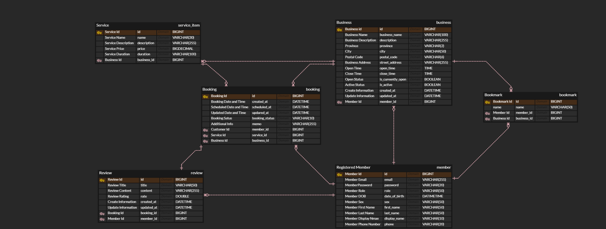

# 📅 EaseBook - Simplify Your Booking Experience

# Project Description 
In today's digital age, people shop online, attend virtual meetings, and book trips through digital platforms. 
However, despite the widespread adoption of digital technologies, many still resort to making phone calls when it comes to checking availability for various services.

EaseBook aims to revolutionize this process by providing a streamlined booking system catering to haircuts, nail services, and various other service-oriented businesses. 
The goal is to enhance efficiency and convenience for both customers and businesses by transitioning from traditional phone-based bookings to a modernized and user-friendly online system.

Say goodbye to traditional calls! 📞 
Check salon availability with our app! 💇‍♂️💅 

#ModernBooking #Convenience

# Backend Project
EaseBook is a backend project that develops server-side functionality to support the booking system. This includes database management, API development, authentication, and business logic implementation.

# ERD

# Features 
## 🦱 Member Management
- **Register:** Users can create accounts to access the booking system.

- **Login/Logout:**
  - Secure authentication for users using Spring Security.
  - Upon login, members receive JWT token for subsequent requests.
  
- **JWT Authentication and Authorization:**
  - JWT Token Usage: Clients include the JWT token in the Authorization header of requests.
  - Authentication: The server verifies the token's signature to authenticate users.
  - Authorization: Certain endpoints require specific roles or permissions, which are encoded in the JWT token.
 
## 🏢 Business Management
- **Register Business:** Service providers can register their businesses.
  
- **Update Business Information:** Business ownsers can modify their business details.
  - Update Business Address: Address includes province, city, street, postal code.
  - Update Business Active Status: If business active status is active, customers can book.
  - Update Business Open Status: If the business is currently operating or not.
  - Update Business Hours: Hours include open hour and close time.
  - Edit Other Basic Information: Basic information includes name, description, phone number.
  
- **Delete Store:** Business owners can remove their business from the platform.
  
- **Read Business Details:** Anyone can read a business’ information.
  
- **Read Business List:** Anyone can get a list of the registered businesses on the application based on the sort (name(a-z), province, city, active status, open status).
 

## 📌 Bookmark Management
- **Add Bookmark:** Customers can bookmark businesses with a custom bookmark name.
    
- **Update Bookmark:** Customers can change the name of their bookmarks.
    
- **Delete Bookmark:** Customers can delete their bookmarks.
    
- **Read Bookmark List:** Customers can read the list of their bookmarks.
  
## 💅 Service Management
- **Register Service:** Business owners can register their services.
    
- **Update Service Information:** Business owners can modify their service details.
    
- **Delete Service:** Business owners can remove their services from their business.
  
- **Read Service Details:** Anyone can read service details.
    
- **Read Service List:** Anyone can get a list of the registered services on the app based on the sort (name(a-z)…etc).
    
- **Read Service List for Each Business:** Anyone can get a list of a business’ registered services based on the sort (name(a-z)…etc).

## 📅 Booking Process
- **Book an Appointment:** Members can schedule appointments.
    
- **Modify a Booking:** Members can adjust their bookings (schedule date, memo).
    
- **Update Booking Status:** Members can cancel or complete existing bookings. 
    
- **Read Booking Details:**
  - Business owners can read their business’ booking details.
  - Customers can read their booking details.
    
- **Read Booking List:**
  - Business owners can read their business’s booking list.
  - Customers can read their booking list.
    
## 📝 Review Management
- **Write a Review:** Customers can write a review for the completed booking. They can also rate their review.
  
- **Modify Review:** Customers can provide feedback on services and modify their reviews.

- **Read Review Details:** Anyone can read a review.
  
- **Read Businesses’ Review List:** Anyone can read business reviews.
  
- **Read Services’ Review List:** Anyone can search reviews by service name.

# Tech Stack
## Programming Languages
 

## Frameworks
 

## Persistence

## Databases
 

## Version Control  

## Tools & Utilities
  

